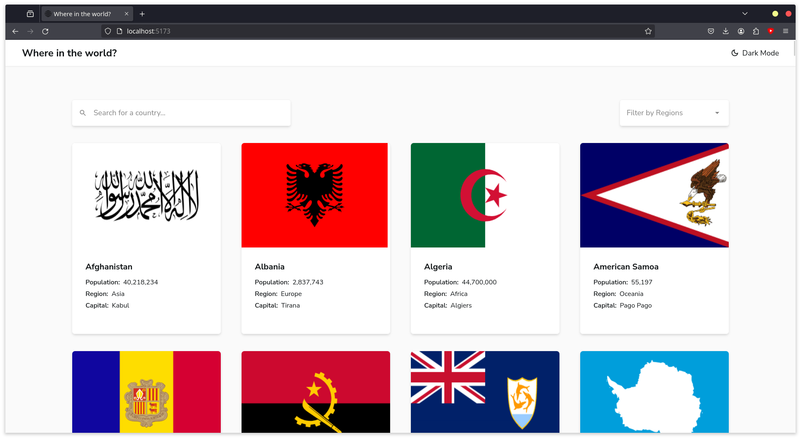
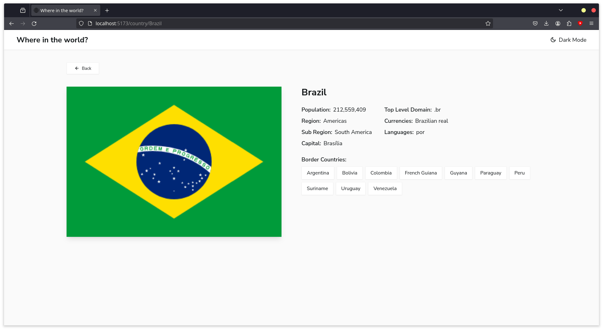
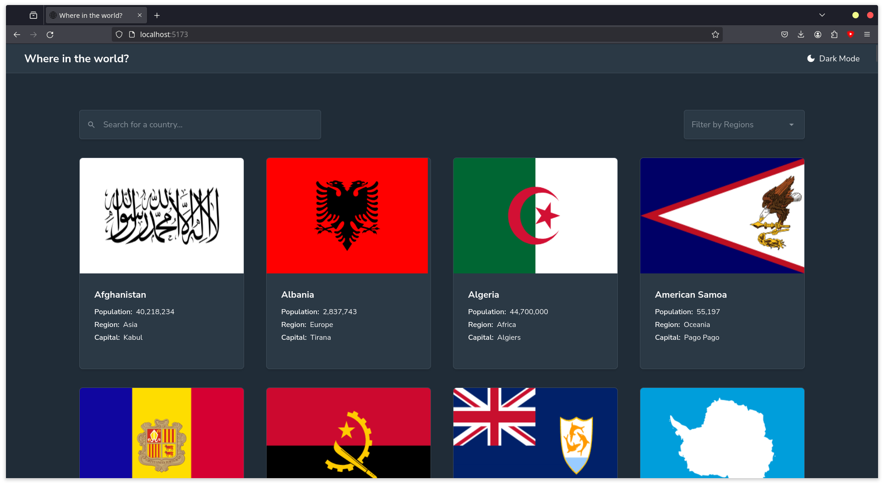
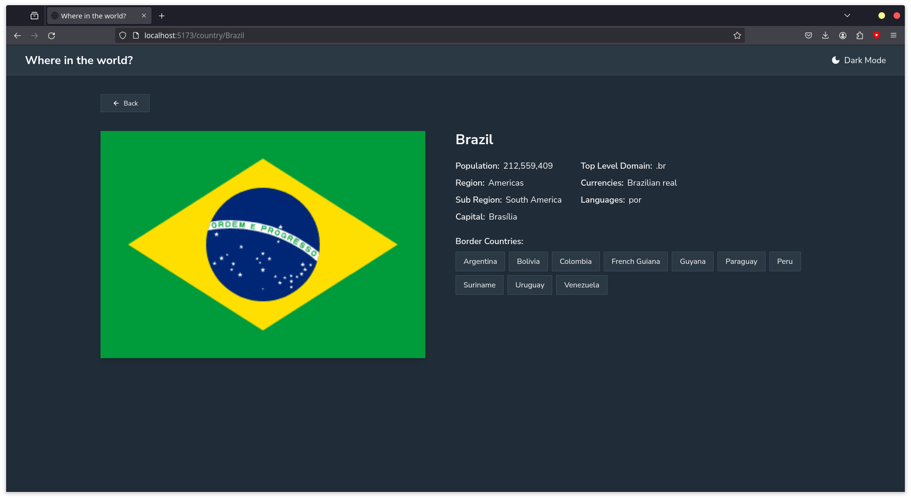
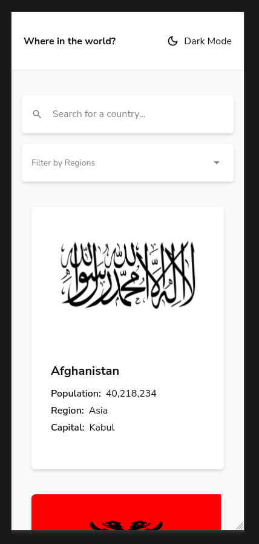
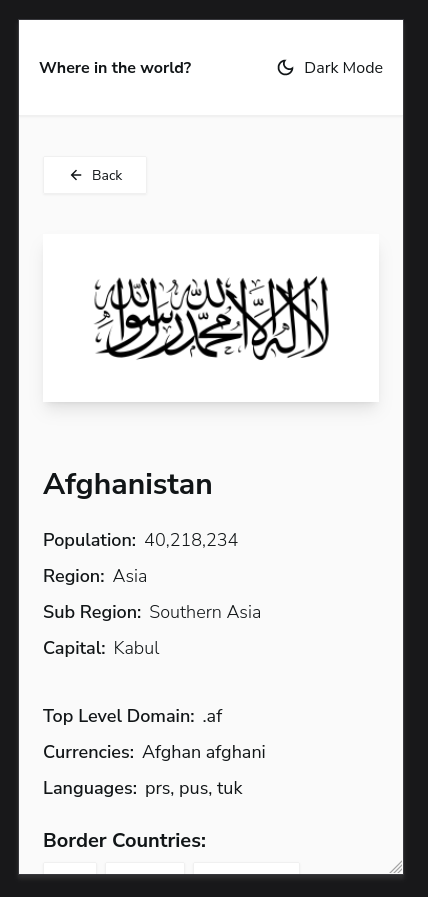
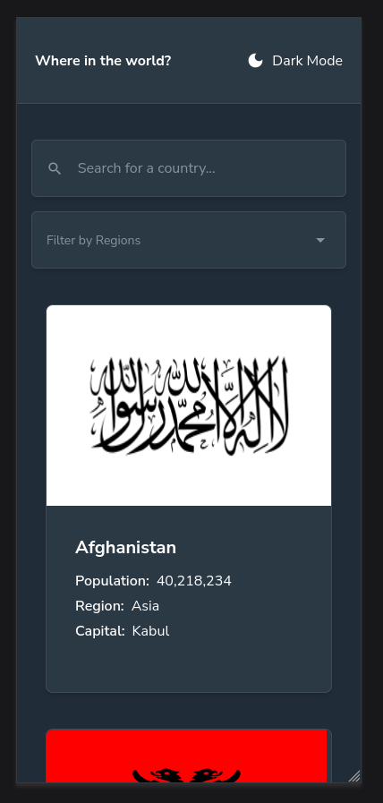
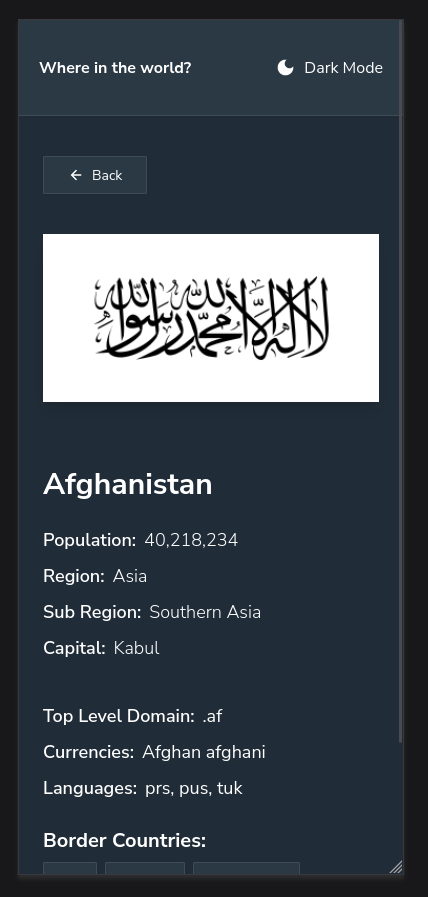

# Frontend Mentor - REST Countries API with color theme switcher solution

This is a solution to the [REST Countries API with color theme switcher challenge on Frontend Mentor](https://www.frontendmentor.io/challenges/rest-countries-api-with-color-theme-switcher-5cacc469fec04111f7b848ca).

## Table of contents

- [Frontend Mentor - REST Countries API with color theme switcher solution](#frontend-mentor---rest-countries-api-with-color-theme-switcher-solution)
  - [Table of contents](#table-of-contents)
  - [Overview](#overview)
    - [The challenge](#the-challenge)
    - [Screenshots](#screenshots)
  - [My process](#my-process)
    - [Built with](#built-with)
    - [What I learned](#what-i-learned)
    - [Continued development](#continued-development)
  - [Author](#author)

**Note: Delete this note and update the table of contents based on what sections you keep.**

## Overview

### The challenge

Users should be able to:

- See all countries from the API on the homepage
- Search for a country using an `input` field
- Filter countries by region
- Click on a country to see more detailed information on a separate page
- Click through to the border countries on the detail page
- Toggle the color scheme between light and dark mode *(optional)*

### Screenshots

## My process

### Built with

- [React](https://reactjs.org/) - JS library
- [Tailwind CSS](https://tailwindcss.com/) - For styles
- [REST Countries API](https://restcountries.com/) - For countries data
- [React Router](https://reactrouter.com/) - For routing
- [TypeScript](https://www.typescriptlang.org/) - For type checking
- [Vite](https://vitejs.dev/) - For build tooling
- [React Icons](https://react-icons.github.io/react-icons/) - For icons

### What I learned

Overall it wasn't too difficult to implement the features required for this challenge. The most challenging part was probably the theming, which I had fiddled with before but never implemented in a project. I also generally use component libraries like PrimeReact, so it was nice to build components from scratch. I mostly exercised my TypeScript skills in this project, which I'm still learning, as well as folder structure and organization.

### Continued development

I want to focus on acessibility in my next projects. I often go the easy route and don't implement things like keyboard navigation or screen reader support. For this project specifically, I would like to add a11y features like aria labels and keyboard navigation, which might be challenging as my inputs are custom and not native HTML inputs. 

## Author

- Frontend Mentor - [Ashlc](https://www.frontendmentor.io/profile/Ashlc)
- GitHub - [Ashlc](https://github.com/Ashlc)
